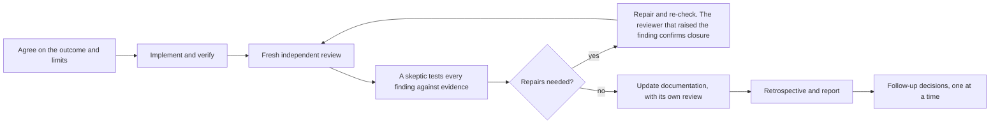

# Nightshift

**Hand over agreed engineering work and come back later to an account of what was built, how it was checked and what remains open.**

Nightshift is a plugin for Claude Code and Codex. You agree on the outcome and the limits. Nightshift takes the work from implementation through independent review and verification, and keeps every unfinished obligation explicit along the way. It ends with a report of what was delivered, what was checked and what still needs your decision.

[Get started](#getting-started), or read on for how it works.

## Why

Delegating work to a coding agent leaves a verification problem: how do you know the result meets the agreement without reading every diff or replaying the session yourself? Nightshift is designed around three ways delegated agent work goes wrong:

- **"Done" is a claim, not evidence.** An agent can report success on work that was never checked against what was agreed.
- **Reviewers are wrong too.** A reviewing agent can report a plausible defect that does not exist, and a reviewer that followed a repair can become anchored on the repaired finding and miss defects around it.
- **Long sessions forget.** When the context is compacted, unfinished obligations can disappear with it.

Nightshift's priority is reliability, through autonomy and trust together. Autonomy means the work keeps moving while you are away. Trust means you can rely on the result without auditing the code yourself. That trust is earned with evidence, not with a confident summary.

## How it works



Simplified. Work that cannot be finished within what you agreed stays open and appears in the report. It is never counted as done.

Two reviewer roles are kept apart on purpose: the reviewer that raised a finding confirms its repair, but only a fresh reviewer can pass the review gate.

## Getting started

**Requirements.** Windows, Node.js 22.23 or later, Git, PowerShell 7, and a native install of Claude Code or Codex CLI. The verified baselines are Claude Code 2.1.268 and Codex CLI 0.154.0. Other operating systems are not yet verified.

Claude Code:

```text
/plugin marketplace add astenlund/nightshift
/plugin install nightshift@astenlund
```

Codex:

```text
codex plugin marketplace add astenlund/nightshift
codex plugin add nightshift@astenlund
```

Then pick an entry point:

- **Review a change you already made.** `/nightshift:revise-code` runs independent review, skeptic validation and repair on your current work.
- **Hand over a task.** Agree the task in conversation, then run `/nightshift:handover`. Before you leave, the agent tells you whether it can continue unattended on your host.
- **Find ready work.** `/nightshift:init-backlog` sets up a backlog under `.nightshift/` in your project. `/nightshift:ready` lists the work whose dependencies are met and recommends what to take on. Listing work does not start it.

Claude Code exposes the skills as `/nightshift:<skill>`. On Codex they take a leading dollar sign instead, as in `$nightshift:revise-code`. Nightshift asks before it begins, and the workflow requires explicit authority before anything is pushed, released or deployed.

The first time you invoke a skill, Nightshift prepares itself. It keeps a manifest-verified copy of the release outside the plugin cache and registers its SessionStart, PreCompact and Stop hooks in your user profile, leaving unrelated hooks alone. It tells you when the host needs an approval or a reopened session.

To update, run `claude plugin update nightshift@astenlund` on Claude Code and restart it. On Codex, `codex plugin marketplace upgrade astenlund` refreshes the marketplace snapshot; whether that alone moves an installed plugin to a newer release is not yet verified. An open session and a resumable run keep the release they started with, and new sessions can pick up the update. Uninstalling the plugin does not remove the hooks it registered. The [release reference](internal/releases/REFERENCE.md) describes the removal operation.

## Design decisions

No single agent's word is enough to call work complete: not the implementer's, not a reviewer's and not that of the agent running the workflow. Each decision below applies that to one way things go wrong.

| Problem | Response |
| --- | --- |
| An agent says it is finished | Completion is a recorded state, not a message. The runtime refuses to complete a code task without current checks and a current independent assessment. |
| A reviewer reports a defect that is not there | Every finding goes to a fresh skeptic that tests it against concrete evidence before any repair. Whether a finding is true, whether fixing it is authorized and whether it is worth fixing are three separate decisions. |
| A reviewer that followed the repair misses the rest | The reviewer that raised a finding, or a replacement given its record, confirms the repair. Only a reviewer working in a fresh context can pass the gate. |
| A review outlives the code it covered | A review is recorded with the inputs it read. Before it can count toward completion, the runtime checks those inputs against the current files. |
| A long session loses track | Commitments, findings, evidence and follow-ups are saved in a local SQLite database, outside the conversation. After the context is compacted, hooks bring back the open obligations and the agent reconciles them with the actual files. |

One release's [acceptance report](.nightshift/reports/resumable-reviewer-dialogue-20261001.md) shows why the fresh pass matters. In a scripted campaign on installed hosts, a test fixture was repaired and the repair was confirmed closed. Fresh reviewers then found two defects the repaired code still had: a NaN counted as a number, and an overflow to Infinity. One fresh reviewer missed both defects; another found the overflow. A fresh pass improves the odds without being a guarantee. While the same release was being built, a reviewer raised an important finding that a fresh skeptic refuted from the spec and the source, so no code was changed to fix a defect that did not exist.

## What you get back

A handed-over run owes you a report, and the runtime does not let the run complete without one. It is written for a reader who saw nothing of the run, and it covers, in this order:

1. What was delivered and how it was verified, with stated limits.
2. Which of the review, documentation and retrospective workflows actually ran, and any that were skipped, blocked or recovered later.
3. Commits made, and whether anything was published.
4. What the retrospective found.
5. Whether the run operated unattended.
6. Every unresolved item: what it is, where it is, what failed, its impact and the choice in front of you.

Follow-up decisions then come to you one at a time, each with a recommendation.

## Skills

| Skill | What it does |
| --- | --- |
| `revise-code` | Independent review, skeptic validation and repair of code |
| `revise-spec` | Independent assessment and repair of a spec |
| `revise-docs` | Brings documentation and backlog in line with what was delivered, under its own review |
| `revise-lore` | Session retrospective that draws lessons from the run and may propose improvements to your agent instructions |
| `handover` | Takes an agreed task or queue through the whole lifecycle, unattended where the host allows |
| `init-backlog` | Sets up or migrates the project backlog under `.nightshift/` |
| `ready` | Lists work whose dependencies are met and recommends what to take on |
| `exploring` | Shows unfinished drafts, kept apart from ready work |

A plain "review" request does not trigger the plugin. "Revise" does.

## Evidence and limits

- **Tests.** A deterministic suite covers the runtime, setup and packaging, including real process-containment checks, and runs in CI on Windows with Node 22. No npm dependencies are required: the code uses Node's built-in modules, including SQLite.
- **Live evidence.** Acceptance reports under [.nightshift/reports](.nightshift/reports) record runs on installed Claude Code and Codex hosts with real models. The project distinguishes three kinds of evidence: deterministic tests, behavior observed on a real host, and behavior that depends on a model following guidance and has not been observed yet.
- **Self-hosting.** Nightshift is built with Nightshift: this repository requires its own lifecycle for agreed implementation work.
- **Cost.** Independent review adds real model usage. Nightshift does not claim to be the cheapest way to get a change made.
- **Platform.** Windows is the only verified platform.
- **Checkout.** One run owns a checkout at a time, and simultaneous independent runs in one checkout are not supported. Review covers regular, singly linked files: symbolic links, hard links and submodules get a diagnosis to reconcile first, as the [runtime reference](internal/runtime/REFERENCE.md) describes.
- **Hosts.** Either host is meant to carry the whole workflow, and review prefers an equally strong model on the other host when one is suitable and available. Unattended operation needs a verified continuation mechanism: a persistent goal on Codex, a Stop hook on Claude Code.
- **Recovery.** Saved state survives context compaction and a closed session. Nothing relaunches the host after a crash or reboot: unattended work stops until you reopen the session, and the agent then reconciles saved state with the actual files.
- **Not a sandbox.** Reviewers work on private copies, which protects the files under review. Probes the agent authorizes run with your privileges and are not sandboxed.
- **Authority.** The workflow requires explicit authority before a push, release or deployment. That is an operating rule the agent follows, not a technical lock.

## Going deeper

- [WORKFLOW.md](WORKFLOW.md) and [VISION.md](VISION.md): the design and its reasoning. Both are working drafts that set direction.
- [The v3 feature](.nightshift/features/nightshift-v3.md): supported scope.
- [Operating brief](internal/workflow.md): the instructions the agent follows.
- [Runtime reference](internal/runtime/REFERENCE.md) and [release reference](internal/releases/REFERENCE.md): operations, setup, updates and removal.
- [Acceptance reports](.nightshift/reports): what was verified, where and with what qualifications.
- [Changelog](CHANGELOG.md): release notes.
- [AGENTS.md](AGENTS.md): development and verification commands.

## Author

Built by Andreas Stenlund. For questions about Nightshift, or about engineering work with AI coding agents, write to a.stenlund@gmail.com.

## License

MIT
